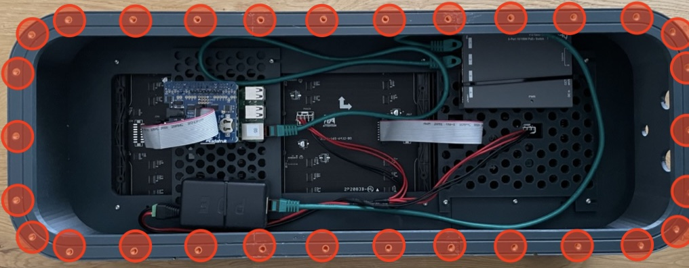
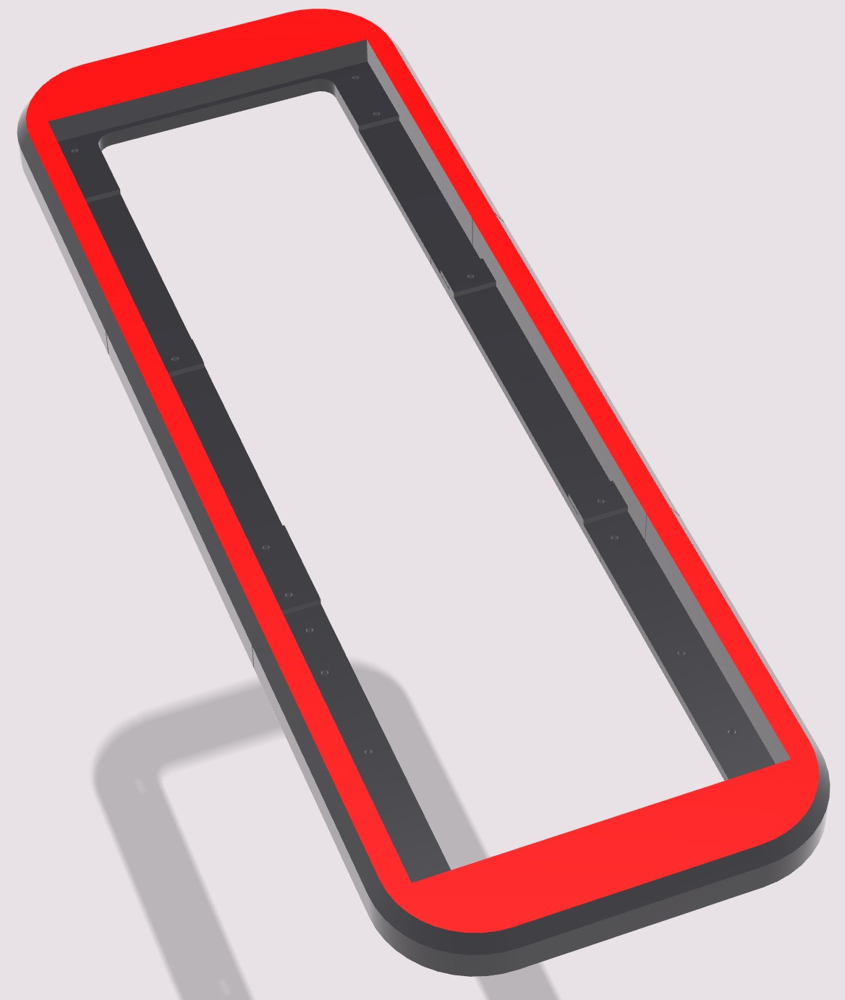
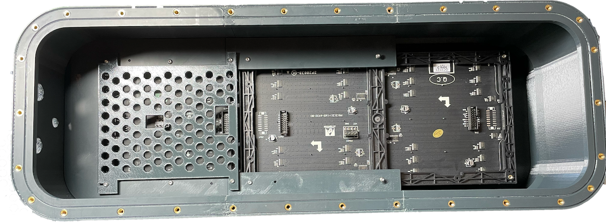
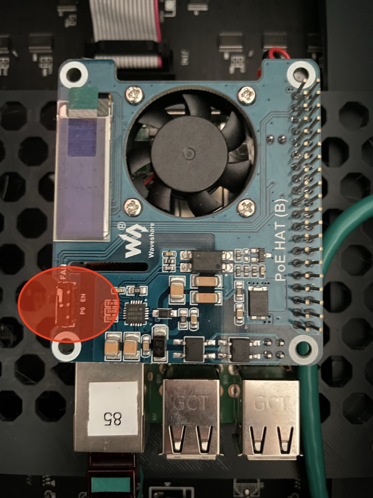
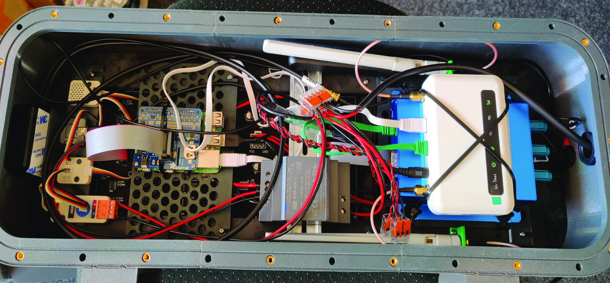

# Gehäusebau

Diese Anleitung ist noch im Aufbau. Eventuell sind ein paar Informationen noch unvollständig oder fehlerhaft. [Vorschläge zu Verbesserungen](https://github.com/bCyberGmbH/leezenflow-doku#kollaboration) werden dankend entgegen genommen!

## Kostenaufstellung

| Name | Anbieter | Link | Preis (Netto) | Versand | Hinweis |
|---|---|---|---|---|---|
| **Gehäuse** |  |  |  |  |  |
| Filament 2x 1kg Prusament PETG   Anthracite Grey | Prusa | https://shop.prusa3d.com/en/prusament/1351-prusament-petg-anthracite-grey-1kg.html | 49,58 € | 5,56 € |  |
| Pattex Sekundenkleber | Amazon | https://amzn.to/3xmu3q3 | 5,87 € | (Amazon Prime) |  |
| Tangit PVC-U Klebstoff | Amazon | https://amzn.to/3hkVlrk | 4,45 € | (Amazon Prime) |  |
| Schrauben Sortiment | Amazon | https://amzn.to/3AwrC6d | 26,81 € | (Amazon Prime) |  |
| Rundschnur Dichtung | Amazon | https://amzn.to/3ywqAph | 6,93 € | (Amazon Prime) |  |
| Platte Rückseite Alu Dibond 4mm | Plattenzuschnitt24 | https://www.plattenzuschnitt24.de/Alu-Dibond-weiss-4mm.html | 18,94 € | 6,95 € |  |
| Scheibe PLEXIGLAS® XT 4mm klar | Plattenzuschnitt24 | https://www.plattenzuschnitt24.de/Plexiglas-XT-4mm-klar.html | 18,13 € | 1 Paket mit obigem Artikel |  |
| Set Dichtungsringe | Amazon | https://amzn.to/3ythIRe | 15,12 € | (Amazon Prime) |  |
| ruthex M4 Gewindeeinsatz | Amazon | https://amzn.to/3ymEfyQ | 7,97 € | (Amazon Prime) |  |
| Eisenglimmer Lack Spraydose | Amazon | https://amzn.to/3hCJ6W0 | 12,47 € | (Amazon Prime) |  |
| Grundierung Spraydose | Amazon | https://amzn.to/3jOdyz1 | 11,64 € | (Amazon Prime) |  |
| Weidmüller DAE M12 PA LONG   Druckausgleichselement M12 | Conrad | https://www.conrad.de/de/p/weidmueller-dae-m12-pa-long-druckausgleichselement-m12-polyamid-schwarz-10-st-362049.html | 56,08 € | 0,00 € | Nur im 5er Pack bestellbar, Pro Gehäuse nur 1 benötigt |
| LAPP 53111220 Kabelverschraubung M20 | Conrad | https://www.conrad.de/de/p/lapp-53111220-kabelverschraubung-m20-polyamid-schwarz-ral-9005-1-st-526826.html | 1,26 € | 0,00 € |  |
| LAPP SKINTOP® GMP-GL-M12 x 1.5   Gegenmutter | Conrad | https://www.conrad.de/de/p/lapp-skintop-gmp-gl-m12-x-1-5-gegenmutter-m12-polyamid-schwarz-ral-9005-1-st-527182.html | 0,16 € | 0,00 € |  |
| Mast Halterung | iQ Parts | https://www.iq-parts-shop.com/en/mounting-brackets-with-straight-legs-h008-ais.html | 12,62 € | 4,95 € |  |
| Silikon | Amazon | https://amzn.to/3dMYZIo | 4,73 € | (Amazon Prime) |  |
| 2mm Klebeband | Amazon | https://amzn.to/3jJBcwM | 8,49 € | (Amazon Prime) |  |
| Kabelverschraubung | Amazon | https://amzn.to/3dPAjyT | 8,39 € | (Amazon Prime) |  |
|  |  |  |  |  |  |
| **Hardware** |  |  |  |  |  |
| 3m Strom Anschlussleitung | Conrad | https://www.conrad.de/de/p/lapp-1600103-1-anschlussleitung-h07rn-f-3-x-1-50-mm-schwarz-meterware-600536.html | 8,10 € | 0,00 € |  |
| GeeekPi Gigabit USB-C PoE-Splitter | Amazon | https://amzn.to/3hl0Sy6 | 17,55 € | (Amazon Prime) |  |
| Cudy FS1006PL 6-Port PoE+ Switch 60 W | Amazon | https://amzn.to/3jQy3LA | 25,04 € | (Amazon Prime) |  |
| Cat. 6A Outdoor Patchkabel | Amazon | https://amzn.to/3wjBehz | 11,64 € | (Amazon Prime) |  |
| DC Buchse LED-Panels | Amazon | https://amzn.to/3jMWh9B | 6,71 € | (Amazon Prime) |  |
| Netzwerkkabel | Amazon | https://amzn.to/2TyO4LE | 7,06 € | (Amazon Prime) |  |
| Raspberry PI 3 B+ | Amazon | https://amzn.to/3AztsDq | 39,74 € | (Amazon Prime) |  |
| SD Karte 32GB | Amazon | https://amzn.to/3hBnIR3 | 5,62 € | (Amazon Prime) |  |
| LED-Panel 32x32 | Digi-Key | https://www.digikey.de/products/de?keywords=1528-2115-ND | 29,51 € | 0,00 € |  |
| LED-Panel 64x32 | Digi-Key | https://www.digikey.de/product-detail/de/adafruit-industries-llc/2277/1528-2504-ND/7035035 | 41,98 € | 0,00 € |  |
| RGB LED Matrix Hat | Digi-Key | https://www.digikey.de/product-detail/de/adafruit-industries-llc/2345/1528-1432-ND/5699181 | 20,97 € | 0,00 € |  |
| Waveshare Power Over Ethernet HAT | Amazon | https://amzn.to/33FRGzO | 29,49€ | (Amazon Prime) |  |
|  |  |  |  |  |  |
| **Hardware (optional) LoRa** |  |  |  |  |  |
| Waveshare Xbee USB Adapter | Amazon | https://amzn.to/3hDZ16t | 11,76 € | (Amazon Prime) |  |
| Sodaq LoRaBee | Sodaq | https://shop.sodaq.com/lorabee-rn2903.html | 33,00 € | 8,87 € |  |
|  |  |  |  |  |  |
| **Verbrauchsmaterial** |  |  |  |  |  |
| Netzwerkstecker zum Crimpen |  |  |  |  |  |
| Wago Klemmen |  |  |  |  |  |
| Kabelbinder |  |  |  |  |  |
| Holzspatel |  |  |  |  |  |
| Kosten Verbrauchsmaterial |  |  | 30,00 € |  |  |
| **Summe** |  |  | **558,32€** | **26,33€** |  |

## Aufwand

| Posten | Personentage  |
|---|---|
| Bestellung/Vorbereitung Planung | 0,5 |
| 3D Druck | 0,5 |
| Gehäuse Bau | 1 |
| Gehäuse Innenleben/Hardware | 0,5 |
| Installation/Konfiguration/Einrichtung | 0,5 |
| Summe | 3 |

## Bestellung Rückwand + Scheibe

Die Scheibe hat eine Breite 19,5 cm und eine Höhe von 56 cm. Die Ecken sind abgerundet mit einem Radius von 4,5 cm.

Die Rückwand hat eine Breite von 20,5 cm und eine Höhe von 57 cm. Die Ecken sind abgerundet mit einem Radius von 5 cm.

## 3D-Druck

Für den 3D-Druck haben wir einen [Prusa i3 MK3S+ Drucker](https://shop.prusa3d.com/de/3d-drucker/181-original-prusa-i3-mk3s-drucker.html) genutzt.
Zum Slicen wurde [PrusaSlicer](https://www.prusa3d.de/prusaslicer/) verwendet. Als "Print Settings" haben wir die Voreinstellung 0.20mm QUALITY genutzt und nur einen Parameter angepasst: Infill -> [Combine infill every](https://help.prusa3d.com/en/article/infill_42#combine-infill-every-x-layers) von 1 auf 2 erhöht. Für die Filament Einstellung haben wir "Prusament PETG" ohne Anpassung genutzt.

Alle `.stl` Dateien für den Druck befinden sich im Ordner [3d-print im Design Repository](https://github.com/bCyberGmbH/leezenflow-design/tree/main/3d-print).
Die Datei `mast-halterung.stl` muss 2x gedruckt werden, alle anderen Dateien 1x.

## Zusammenbau

Alle gedruckten Teile, mit dem Präfix `case` im Namen + die beiden Masthalterungen, müssen mit dem PVC-U Kleber verklebt werden. Hier nicht mit Kleber sparen! Die Klebestellen müssen später wasserdicht sein. Eventuelle Lücken können mit Sekundenkleber (da dieser dünnflüssiger ist) nachgebessert werden.

- Zum Auftragen des Klebers sollte man z.B. Einweg-Holzspatel nutzen.
- Bei sehr warmen Wetter kann der Kleber zu schnell trocknen, am besten den Kleber vorher kühlen.
- Zum Zusammenfügen der Teile kann es nötig sein (z.B. mit einem Gummihammer) ein wenig nachzuhelfen.
- Klebereste, die von außen zu sehen sind, sollten vor dem Lackieren (z.B. mit einem Stechbeitel) entfernt werden. Außerdem die Oberfläche mit Schmirgelpapier anrauen.

Auch die seitlichen Halterungen am Gehäuse ankleben. Dazu die komplette Kontaktfläche mit Kleber bedecken.

Darauf achten, die Halterungen komplett einzuschieben. Stehen die Halterungen zu weit oben, kann das Gehäuse undicht werden!

Nach dem Verkleben müssen noch die Gewindeeinsätze eingelassen werden.

## Lackieren

Vor dem Lackieren sollten alle Schmirgelreste entfernt werden. Die Rückseite (die Seite mit den Gewindeeinsätzen) nicht lackieren! Am besten mit Malerkrepp-Klebeband abkleben. 2 Lackschichten auf allen Teilen sollten ausreichen.  
Zudem darauf achten, dass das Loch unten an der Vorderseite frei bleibt. Dies dient zum Abfluss von Regenwasser.  

Zusätzlich zum Gehäuse muss auch der LED Rahmen von oben (Orientierung genau wie auf dem Druckbett) lackiert werden.

## Dichtungen

Die beiden Dichtungsrillen auf der Rückseite mit dem 2 mm Klebeband auslegen. Anschließend die Rundschnur einkleben. Dabei die Naht der Schnur im unteren Bereich des Gehäuses platzieren (blauer Pfeil).

## LED-Panels mit Rahmen einbauen

Das nachfolgende Bild zeigt die Position der Schrauben.  
Rot markiert = M3x10 Schraube  
Blau markiert = M3x16 Schraube

Achtung: Den Rahmen noch nicht komplett verschrauben. Er muss aus Platzgründen in 2 Schritten in das Gehäuse eingebaut werden.

Im ersten Schritt die abgebildeten Rahmenteile verschrauben und in das Gehäuse einlegen (wie abgebildet ohne das obere Rahmenteil):

Anschließend das fehlende Rahmenteil einfügen und mit dem LED-Panel verschrauben.

### Raspberry PI

SD-Karte in Raspberry einsetzen.

Zuerst den Waveshare Power Over Ethernet HAT auf die GPIO Pins des Raspberry setzen. Dabei den Schalter für die Lüftersteuerung auf dauerthaft eingeschaltet stellen (Position EN).

Den RGB LED Matrix Hat vorbereiten, wie in [leezenflow-code](https://github.com/bCyberGmbH/leezenflow-code#requirements) beschrieben (Brücke zwischen GPIO Pin 4 und 18 löten).
Anschließend den RGB LED Matrix Hat auf den PoE HAT stecken.

## Verkabelung und Hardware-Einbau

Zuerst das Stromkabel der LED-Panels anschließen. Hierzu kann es nötig sein, die eine Halterung noch einmal vom Rahmen zu lösen. An das Ende des Stromkabels muss die DC-Buchse angebracht werden, damit diese an den POE-Splitter angeschlossen werden kann.

Nun das Flachbandkabel zwischen den LED-Panels wie abgebildet anschließen.  
Dann kann der POE Splitter und der Raspberry auf der oberen Halterung mit Kabelbindern angebracht werden. Anschließend das Flachbandkabel des LED-Panels mit dem RGB LED Matrix HAT verbinden.

Anschließed kann der POE+ Switch im unteren Bereich befestigt werden. Hiervon geht ein LAN-Kabel zum Raspberry PI, eins in den POE-Splitter und ein LAN-Kabel durch die Kabelverschraubung nach außen. Das LAN-Kabel, welches aus dem Gehäuse führt, ist für Strom- und Datenübertragung der Road-Side-Unit. Es kann nötig sein den Stecker für das RSU Netzwerk Kabel abzuschneiden, das Kabel durch die Kabelverschraubung zu führen und dann einen neuen Stecker zu krimpen.

Für die 230V Versorgung des POE+ Switches kann das mitgelieferte Kabel genutzt werden, indem der Schuko Stecker abgetrennt wird. Das Kabel dann mit der 230V Zuleitung (z.B. mit Wago Klemmen) verbinden.

Neben den beiden Kabeldurchführungen muss dann noch das Druckausgleichselement verschraubt werden.

## Scheibe einkleben

Die Scheibe muss eventuell an den Kanten noch etwas beigeschliffen werden. Anschließend die Scheibe mit Silikon von vorne abdichten (grüne Linie).
Dabei darauf achten, dass das Loch frei bleibt.

## Rückwand

In die Rückwand müssen an den Stellen der Gewindeeinsätze Löcher für die M4-Schrauben gebohrt werden. Ein Versuch, die Platte vom Zulieferer bohren zu lassen, war bei uns leider nicht erfolgreich (vermutlich wegen der leichten Toleranzen durch 3D Druck und Verkleben der Elemente).
Die Rückwand mit den M4-Schrauben verschließen. Dabei zwischen Schraube und Gehäuse jeweils einen M4 1 mm Dichtungsring einsetzen.
